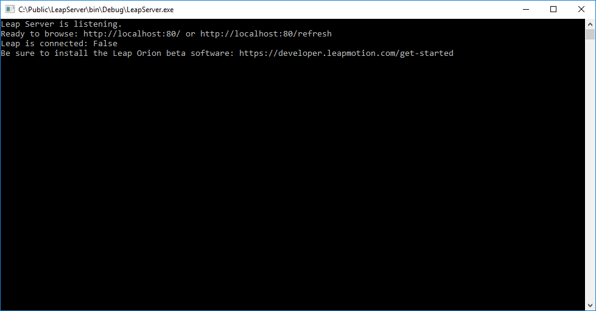
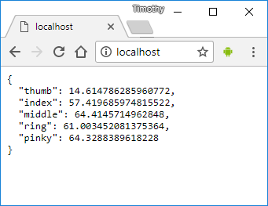
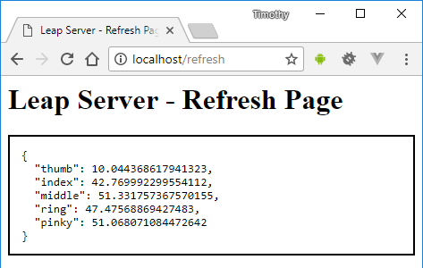

# Leap HTTP Server

The HTTP Server is a C# Console App that uses a `HTTPListener` to serve data from the `Leap Motion Controller`. `Raspberry PI` or `Arduino` devices can send `HTTP` requests to the server so that the `Leap` can be used with `IoT` devices.

## Console App

When the console app runs, the HTTPListener begins listening.



Browse [http://localhost](http://localhost) which return 0 data until a controller or hand is detected.

```
{
  "thumb": 0,
  "index": 0,
  "middle": 0,
  "ring": 0,
  "pinky": 0
}
```

Make sure that the [Orion SDK](https://developer.leapmotion.com/get-started/) is installed so that the `Leap Motion Controller` can be detected.



You can also browse [http://localhost/refresh](http://localhost/refresh) to get an HTML5 page that auto refreshes.


